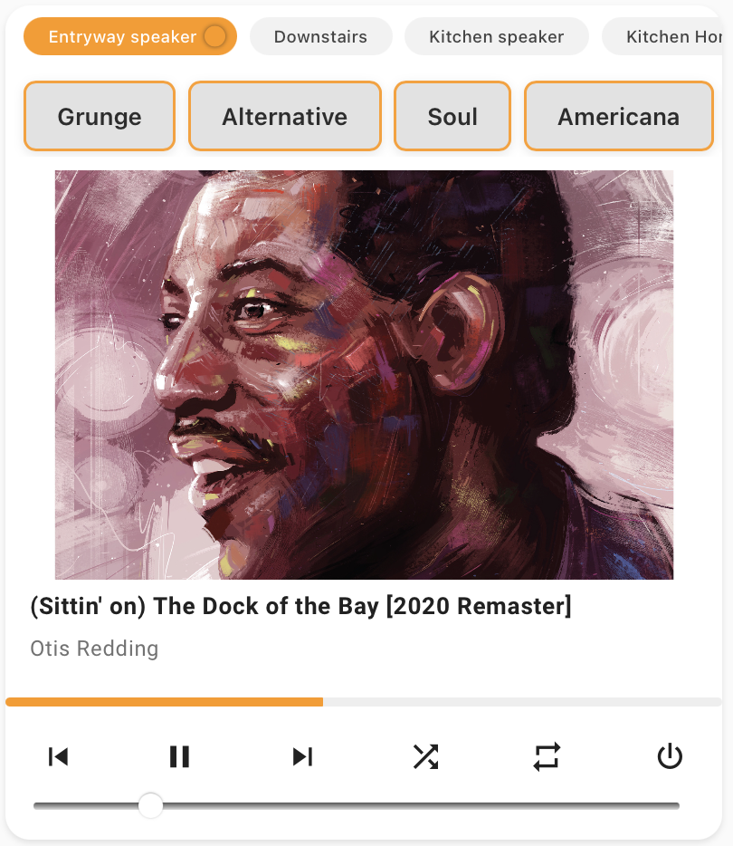

# Yet Another Media Player

Home Assistant Lovelace card for controlling multiple media players with chip-based switching and a customizable actions.

---

## Features

- Switch between multiple media players in a single card using chip-style selector
- Custom chip/entity names via YAML
- Optional full-card artwork background 
- Shuffle, repeat, and playback controls for compatible players
- Auto-switches to the active media player
- Action buttons run any Home Assistant service or script
- Use "current" for the entity_id to reference the currently selected media player (see example below)

---

## Screenshot



*Example: Multiple media players, custom chip names, action buttons, and artwork background.*

---

## Basic Usage

Add the card to your Lovelace dashboard using YAML (recommended for custom chip/entity names):

```yaml
type: custom:yet-another-media-player
entities:
  - media_player.downstairs_2
  - media_player.kitchen_speaker_2
  - media_player.kitchen_homepod
  - media_player.living_room_apple_tv
  - media_player.bedroom
  - media_player.entryway_speaker
actions:
  - name: Grunge
    service: music_assistant.play_media
    service_data:
      entity_id: current
      media_id: apple_music://playlist/pl.5feba9fd5ea441a29aeb3597c8314384
      enqueue: replace
  - name: Alternative
    service: music_assistant.play_media
    service_data:
      entity_id: current
      media_id: apple_music://playlist/pl.5feba9fd5ea441a29aeb3597c8314384
      enqueue: replace
  - name: Soul
    service: music_assistant.play_media
    service_data:
      entity_id: current
      media_id: apple_music://playlist/pl.3cb881c4590341fabc374f003afaf2b4
      enqueue: replace
  - name: Americana
    service: music_assistant.play_media
    service_data:
      entity_id: current
      media_id: apple_music://playlist/pl.09d2969fa441483eba00a5ec41e279eb
      enqueue: replace
  - name: Country
    service: music_assistant.play_media
    service_data:
      entity_id: current
      media_id: apple_music://playlist/pl.064dfb9229794de696c4376426d709ac
      enqueue: replace
  - name: Dinner
    service: music_assistant.play_media
    service_data:
      entity_id: current
      media_id: apple_music://playlist/pl.6a236667fbc046a49b48ea9cf4e8b639
      enqueue: replace
artwork_background: false
volume_mode: slider

## Action Buttons and the “current” Entity

Action buttons let you trigger **any** Home Assistant service.

If you use `entity_id: current` in your action’s `service_data`, it will **automatically target the currently selected media player** in the card UI.

